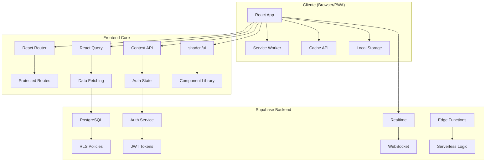

# 🏗️ Arquitetura - Fiden Agency

## 📋 Índice

- [🎯 Visão Geral](#-visão-geral)
- [🏛️ Arquitetura do Sistema](#️-arquitetura-do-sistema)
- [📁 Estrutura de Pastas](#-estrutura-de-pastas)
- [🔄 Fluxo de Dados](#-fluxo-de-dados)
- [🔐 Segurança](#-segurança)
- [📱 PWA Architecture](#-pwa-architecture)
- [🎨 Padrões de Design](#-padrões-de-design)
- [🚀 Performance](#-performance)

---

## 🎯 Visão Geral

O **Fiden Agency** é construído seguindo uma arquitetura moderna e escalável baseada em:

- **Frontend**: React 18 + TypeScript + Vite
- **Backend**: Supabase (PostgreSQL + Auth + Realtime)
- **PWA**: Service Worker + Manifest + Cache API
- **State Management**: React Query + Context API
- **UI/UX**: Tailwind CSS + shadcn/ui + Framer Motion

### 🎯 **Princípios Arquiteturais**

1. **📱 Mobile-First**: Design responsivo priorizando dispositivos móveis
2. **⚡ Performance**: Lazy loading, code splitting, cache inteligente
3. **🔐 Security-First**: RLS policies, auth context, input validation
4. **🔄 Real-time**: WebSocket connections para atualizações instantâneas
5. **📴 Offline-Ready**: PWA com cache estratégico para uso offline
6. **🧪 Testável**: Estrutura modular com testes unitários
7. **♿ Acessível**: Componentes com ARIA labels e navegação por teclado

---

## 🏛️ Arquitetura do Sistema



### 🔧 **Componentes Principais**

#### **Frontend Layer**
- **React App**: SPA com roteamento client-side
- **TypeScript**: Tipagem estática para robustez
- **Vite**: Build tool para desenvolvimento rápido
- **PWA**: Experiência nativa multiplataforma

#### **State Management**
- **React Query**: Cache e sincronização de dados server
- **Context API**: Estado global (auth, theme, notifications)
- **Local State**: useState/useReducer para UI local

#### **Backend Layer**
- **Supabase Database**: PostgreSQL com RLS
- **Auth**: JWT-based com multi-role support
- **Realtime**: WebSocket para atualizações instantâneas
- **Storage**: Upload de imagens e arquivos

---

## 📁 Estrutura de Pastas

```
fiden-agency/
├── 📁 public/                    # Assets estáticos
│   ├── 📁 icons/                # Ícones PWA (48x48 até 512x512)
│   ├── 📄 manifest.json         # PWA Manifest
│   ├── 📄 sw.js                 # Service Worker
│   └── 📄 offline.html          # Página offline
│
├── 📁 src/                       # Código fonte principal
│   ├── 📁 components/           # Componentes React reutilizáveis
│   │   ├── 📁 ui/               # shadcn/ui base components
│   │   ├── 📄 ErrorBoundary.tsx # Error handling global
│   │   ├── 📄 ProtectedRoute.tsx# Route protection
│   │   └── 📄 PWAInstallPrompt.tsx # PWA install UI
│   │
│   ├── 📁 contexts/             # React Contexts
│   │   ├── 📄 AuthContext.tsx   # Autenticação e usuário
│   │   └── 📄 ThemeContext.tsx  # Dark/Light theme
│   │
│   ├── 📁 hooks/                # Custom React Hooks
│   │   ├── 📄 useAuth.ts        # Hook de autenticação
│   │   ├── 📄 useRealtimeSubscription.ts # Realtime data
│   │   ├── 📄 useResponsive.ts  # Responsive utilities
│   │   └── 📄 useUserRole.ts    # Role-based permissions
│   │
│   ├── 📁 integrations/         # Integrações externas
│   │   └── 📁 supabase/         # Configuração Supabase
│   │       ├── 📄 client.ts     # Client setup
│   │       └── 📄 types.ts      # Database types
│   │
│   ├── 📁 lib/                  # Utilitários e helpers
│   │   ├── 📄 utils.ts          # Funções utilitárias
│   │   ├── 📄 logger.ts         # Sistema de logging
│   │   └── 📄 validations.ts    # Schemas de validação
│   │
│   ├── 📁 pages/                # Páginas da aplicação
│   │   ├── 📄 Index.tsx         # Homepage
│   │   ├── 📄 Dashboard.tsx     # Admin dashboard
│   │   ├── 📄 ClientPanel.tsx   # Painel do cliente
│   │   ├── 📄 Booking.tsx       # Sistema de agendamento
│   │   └── 📄 Settings.tsx      # Configurações
│   │
│   ├── 📁 providers/            # Providers de contexto
│   │   └── 📄 ThemeProvider.tsx # Theme context provider
│   │
│   ├── 📁 __tests__/            # Testes unitários
│   │   ├── 📁 components/       # Testes de componentes
│   │   ├── 📁 hooks/            # Testes de hooks
│   │   └── 📁 utils/            # Testes de utilitários
│   │
│   ├── 📄 App.tsx               # Componente raiz
│   ├── 📄 main.tsx              # Entry point
│   └── 📄 vite-env.d.ts         # Types do Vite
│
├── 📁 supabase/                 # Configurações Supabase
│   ├── 📁 migrations/           # Migrações do banco
│   ├── 📄 config.toml          # Configuração local
│   └── 📄 seed.sql             # Dados iniciais
│
├── 📁 docs/                     # Documentação
│   ├── 📄 README.md            # Documentação principal
│   ├── 📄 ARCHITECTURE.md      # Arquitetura (este arquivo)
│   ├── 📄 PWA_GUIDE.md         # Guia PWA
│   └── 📄 MELHORIAS_PROJETO.md # Roadmap
│
└── 📄 Configuration Files       # Arquivos de configuração
    ├── 📄 package.json          # Dependencies e scripts
    ├── 📄 tsconfig.json         # TypeScript config
    ├── 📄 tailwind.config.js    # Tailwind CSS config
    ├── 📄 vite.config.ts        # Vite bundler config
    └── 📄 .env.example          # Environment variables template
```

---

## 🔄 Fluxo de Dados

### **1. 🔐 Autenticação**

```typescript
// AuthContext gerencia estado global do usuário
const AuthContext = createContext<AuthContextType>()

// Hook para acesso fácil ao contexto
const { user, login, logout, loading } = useAuth()

// Proteção de rotas baseada em roles
<ProtectedRoute allowedRoles={['admin', 'funcionario']}>
  <Dashboard />
</ProtectedRoute>
```

### **2. 📊 Gestão de Estado Server**

```typescript
// React Query para cache e sincronização
const { data: appointments, isLoading } = useQuery({
  queryKey: ['appointments', barbeariaId],
  queryFn: () => fetchAppointments(barbeariaId),
  refetchInterval: 30000, // Re-fetch a cada 30s
})

// Mutations para alterações
const mutation = useMutation({
  mutationFn: createAppointment,
  onSuccess: () => {
    queryClient.invalidateQueries(['appointments'])
  }
})
```

### **3. ⚡ Real-time Updates**

```typescript
// Hook customizado para subscriptions
useRealtimeSubscription({
  table: 'agendamentos',
  onUpdate: (payload) => {
    // Atualizar cache do React Query
    queryClient.setQueryData(['appointments'], (old) =>
      updateAppointmentInList(old, payload.new)
    )

    // Tocar som de notificação
    playNotificationSound()
  }
})
```

### **4. 💾 Cache Strategy**

```typescript
// Service Worker cache strategy
self.addEventListener('fetch', (event) => {
  if (event.request.destination === 'document') {
    // Network First para páginas HTML
    event.respondWith(networkFirstStrategy(event.request))
  } else if (event.request.destination === 'image') {
    // Cache First para imagens
    event.respondWith(cacheFirstStrategy(event.request))
  }
})
```

---

## 🔐 Segurança

### **Row Level Security (RLS)**

Todas as tabelas implementam políticas RLS baseadas no contexto do usuário:

```sql
-- Política para agendamentos: usuário só vê seus próprios dados
CREATE POLICY "agendamentos_select_policy" ON agendamentos
FOR SELECT USING (
  auth.uid() = cliente_id OR
  is_staff_of_barbearia(auth.uid(), barbearia_id)
);

-- Função helper para verificar se usuário é staff
CREATE OR REPLACE FUNCTION is_staff_of_barbearia(user_id UUID, barbearia_id UUID)
RETURNS BOOLEAN AS $$
BEGIN
  RETURN EXISTS (
    SELECT 1 FROM profiles
    WHERE id = user_id
    AND barbearia_id = barbearia_id
    AND role IN ('admin', 'funcionario')
  );
END;
$$ LANGUAGE plpgsql SECURITY DEFINER;
```

### **Frontend Security**

```typescript
// Validação de inputs com Zod
const appointmentSchema = z.object({
  barbeariaId: z.string().uuid(),
  serviceId: z.string().uuid(),
  date: z.string().datetime(),
  clientName: z.string().min(2).max(100)
})

// Rate limiting client-side
function checkRateLimit(key: string, maxAttempts: number = 5): boolean {
  const now = Date.now()
  const record = rateLimitMap.get(key)

  if (!record || now > record.resetTime) {
    rateLimitMap.set(key, { count: 1, resetTime: now + 900000 }) // 15 min
    return true
  }

  return record.count < maxAttempts
}
```

### **Auth Flow**

1. **Login**: Supabase Auth com JWT tokens
2. **Session**: Token armazenado em httpOnly cookie (quando possível)
3. **Refresh**: Auto-refresh tokens antes da expiração
4. **Logout**: Invalidação de tokens server-side

---

## 📱 PWA Architecture

### **Service Worker Strategy**

```javascript
// Cache de recursos por estratégia
const CACHE_STRATEGIES = {
  // App Shell: Cache First
  static: ['/', '/manifest.json', '/icons/*'],

  // API: Network First com fallback
  api: ['/api/*', '*.supabase.co/*'],

  // Imagens: Cache First com TTL
  images: ['*.jpg', '*.png', '*.webp'],

  // Páginas: Network First
  pages: ['/barbershops', '/booking', '/login']
}
```

### **Offline Capabilities**

```typescript
// Detecção de conectividade
const [isOnline, setIsOnline] = useState(navigator.onLine)

useEffect(() => {
  const handleOnline = () => setIsOnline(true)
  const handleOffline = () => setIsOnline(false)

  window.addEventListener('online', handleOnline)
  window.addEventListener('offline', handleOffline)

  return () => {
    window.removeEventListener('online', handleOnline)
    window.removeEventListener('offline', handleOffline)
  }
}, [])

// Sync quando voltar online
useEffect(() => {
  if (isOnline) {
    syncPendingData()
  }
}, [isOnline])
```

### **Background Sync**

```javascript
// Registrar sync quando offline
if ('serviceWorker' in navigator && 'sync' in window.ServiceWorkerRegistration.prototype) {
  navigator.serviceWorker.ready.then(registration => {
    return registration.sync.register('background-sync')
  })
}

// Service Worker sync handler
self.addEventListener('sync', event => {
  if (event.tag === 'background-sync') {
    event.waitUntil(syncAppointments())
  }
})
```

---

## 🎨 Padrões de Design

### **Component Patterns**

#### **1. Compound Components**
```typescript
// Uso de children para composição flexível
export const Card = ({ children, className, ...props }) => {
  return (
    <div className={cn("rounded-lg border bg-card", className)} {...props}>
      {children}
    </div>
  )
}

Card.Header = CardHeader
Card.Content = CardContent
Card.Footer = CardFooter
```

#### **2. Render Props**
```typescript
// Hook que retorna renderProps para loading states
export const useAsyncData = <T>(fetcher: () => Promise<T>) => {
  const [state, setState] = useState<AsyncState<T>>({ loading: true })

  return {
    ...state,
    render: ({ loading, error, data }: RenderProps<T>) => {
      if (loading) return loading()
      if (error) return error(error)
      return data(data!)
    }
  }
}
```

#### **3. Higher-Order Components**
```typescript
// HOC para proteção de rotas
export const withRoleGuard = (allowedRoles: Role[]) =>
  <P extends object>(Component: React.ComponentType<P>) => {
    return (props: P) => {
      const { role } = useUserRole()

      if (!allowedRoles.includes(role)) {
        return <Navigate to="/unauthorized" />
      }

      return <Component {...props} />
    }
  }
```

### **State Management Patterns**

#### **1. Custom Hooks para Business Logic**
```typescript
// Hook encapsula lógica de agendamento
export const useAppointmentBooking = () => {
  const [step, setStep] = useState(1)
  const [selectedService, setSelectedService] = useState<Service>()
  const [selectedDateTime, setSelectedDateTime] = useState<DateTime>()

  const bookAppointment = useMutation({
    mutationFn: createAppointment,
    onSuccess: () => {
      toast.success("Agendamento realizado!")
      navigate("/appointments")
    }
  })

  return {
    step,
    selectedService,
    selectedDateTime,
    setStep,
    setSelectedService,
    setSelectedDateTime,
    bookAppointment: bookAppointment.mutate,
    isLoading: bookAppointment.isLoading
  }
}
```

#### **2. Optimistic Updates**
```typescript
// Atualização otimista para UX responsiva
const toggleFavorite = useMutation({
  mutationFn: updateFavorite,
  onMutate: async (newFavorite) => {
    // Cancel queries para evitar conflitos
    await queryClient.cancelQueries(['barbershops'])

    // Snapshot do estado anterior
    const previousBarbershops = queryClient.getQueryData(['barbershops'])

    // Atualização otimista
    queryClient.setQueryData(['barbershops'], old =>
      old.map(shop =>
        shop.id === newFavorite.id
          ? { ...shop, isFavorite: newFavorite.isFavorite }
          : shop
      )
    )

    return { previousBarbershops }
  },
  onError: (err, newFavorite, context) => {
    // Rollback em caso de erro
    queryClient.setQueryData(['barbershops'], context.previousBarbershops)
  }
})
```

---

## 🚀 Performance

### **1. Code Splitting**

```typescript
// Lazy loading de páginas
const Dashboard = lazy(() => import('./pages/Dashboard'))
const ClientPanel = lazy(() => import('./pages/ClientPanel'))

// Componente de loading
const PageLoader = () => (
  <div className="flex h-screen items-center justify-center">
    <Loader2 className="h-8 w-8 animate-spin" />
  </div>
)

// Suspense boundary
<Suspense fallback={<PageLoader />}>
  <Routes>
    <Route path="/dashboard" element={<Dashboard />} />
    <Route path="/client" element={<ClientPanel />} />
  </Routes>
</Suspense>
```

### **2. Memoization**

```typescript
// Memoização de componentes pesados
const ExpensiveComponent = memo(({ data, onUpdate }) => {
  const processedData = useMemo(() =>
    processLargeDataset(data), [data]
  )

  const handleUpdate = useCallback((id: string) => {
    onUpdate(id)
  }, [onUpdate])

  return <DataVisualization data={processedData} onUpdate={handleUpdate} />
})

// Memoização de contexto para evitar re-renders
const AuthContext = createContext<AuthContextType>(null!)

export const AuthProvider = ({ children }) => {
  const [user, setUser] = useState<User | null>(null)

  const contextValue = useMemo(() => ({
    user,
    login: useCallback(async (credentials) => {
      // login logic
    }, []),
    logout: useCallback(async () => {
      // logout logic
    }, [])
  }), [user])

  return (
    <AuthContext.Provider value={contextValue}>
      {children}
    </AuthContext.Provider>
  )
}
```

### **3. Virtual Scrolling**

```typescript
// Para listas grandes (100+ items)
import { FixedSizeList as List } from 'react-window'

const AppointmentsList = ({ appointments }) => {
  const Row = ({ index, style }) => (
    <div style={style}>
      <AppointmentCard appointment={appointments[index]} />
    </div>
  )

  return (
    <List
      height={600}
      itemCount={appointments.length}
      itemSize={120}
      itemData={appointments}
    >
      {Row}
    </List>
  )
}
```

### **4. Bundle Optimization**

```typescript
// vite.config.ts
export default defineConfig({
  build: {
    rollupOptions: {
      output: {
        manualChunks: {
          // Vendor chunks
          vendor: ['react', 'react-dom'],
          ui: ['@radix-ui/react-dialog', '@radix-ui/react-select'],
          charts: ['recharts'],

          // Feature chunks
          dashboard: ['./src/pages/Dashboard.tsx'],
          booking: ['./src/pages/Booking.tsx']
        }
      }
    },

    // Compressão
    minify: 'terser',
    terserOptions: {
      compress: {
        drop_console: true,
        drop_debugger: true
      }
    }
  }
})
```

---

## 📊 Monitoring & Analytics

### **Error Boundaries**

```typescript
class ErrorBoundary extends Component<Props, State> {
  constructor(props: Props) {
    super(props)
    this.state = { hasError: false, error: null }
  }

  static getDerivedStateFromError(error: Error): State {
    return { hasError: true, error }
  }

  componentDidCatch(error: Error, errorInfo: ErrorInfo) {
    // Log para serviço de monitoring
    logger.error('Error Boundary caught an error', {
      error: error.message,
      stack: error.stack,
      componentStack: errorInfo.componentStack
    })
  }

  render() {
    if (this.state.hasError) {
      return <ErrorFallback error={this.state.error} />
    }

    return this.props.children
  }
}
```

### **Performance Monitoring**

```typescript
// Hook para medir performance de componentes
export const usePerformanceMonitor = (componentName: string) => {
  useEffect(() => {
    const startTime = performance.now()

    return () => {
      const endTime = performance.now()
      const renderTime = endTime - startTime

      if (renderTime > 16) { // > 1 frame (16ms)
        logger.warn(`Slow render detected: ${componentName}`, {
          renderTime: `${renderTime.toFixed(2)}ms`
        })
      }
    }
  }, [componentName])
}

// Web Vitals tracking
import { getCLS, getFID, getFCP, getLCP, getTTFB } from 'web-vitals'

getCLS(console.log)
getFID(console.log)
getFCP(console.log)
getLCP(console.log)
getTTFB(console.log)
```

---

## 🔮 Futuras Melhorias

### **1. Micro-frontends**
```typescript
// Modularização para escala
const BookingModule = lazy(() => import('@fiden/booking-module'))
const DashboardModule = lazy(() => import('@fiden/dashboard-module'))
```

### **2. Server-Side Rendering**
```typescript
// Next.js ou Remix para SEO
// Hydration strategy para performance
```

### **3. Edge Computing**
```typescript
// Supabase Edge Functions para lógica de negócio
// CDN caching para assets estáticos
```

### **4. Real-time Collaboration**
```typescript
// WebRTC para chat em tempo real
// Collaborative editing de configurações
```

---

<div align="center">

**Esta arquitetura fornece uma base sólida, escalável e mantível para o crescimento contínuo do Fiden Agency.**

🏗️ **Modular** • ⚡ **Performante** • 🔐 **Segura** • 📱 **Mobile-First**

</div>