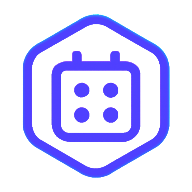

# 🚀 Agendem - Sistema de Agendamento para Barbearias

<div align="center">



**Sistema completo de agendamento e gestão para barbearias com PWA, real-time e funcionalidades avançadas.**

[](https://typescriptlang.org/)
[](https://reactjs.org/)
[](https://supabase.com/)
[](https://web.dev/progressive-web-apps/)

[🌐 Demo ao Vivo](https://fiden-agency.lovable.app) • [📱 PWA Guide](PWA_GUIDE.md) • [🏗️ Arquitetura](ARCHITECTURE.md)

</div>

---

## 📋 Índice

- [🌟 Funcionalidades](#-funcionalidades)
- [🚀 Quick Start](#-quick-start)
- [🛠️ Tecnologias](#️-tecnologias)
- [📱 PWA Features](#-pwa-features)
- [🗄️ Banco de Dados](#️-banco-de-dados)
- [🔧 Configuração](#-configuração)
- [🧪 Testes](#-testes)
- [🚀 Deploy](#-deploy)

---

## 🌟 Funcionalidades

### 👥 **Multi-perfil**
- **Clientes**: Agendamento, histórico, recompensas, avaliações
- **Barbearias (Admin)**: Dashboard, gestão de agendamentos, equipe, serviços
- **Funcionários**: Agenda pessoal, clientes, pausas e ausências

### 📅 **Agendamento Inteligente**
- ✅ **Auto-confirmação** de agendamentos
- 🔔 **Notificações em tempo real** com som personalizável
- 📱 **Sistema offline** para consultas básicas
- ⏰ **Controle de horários** e disponibilidade
- 🚫 **Prevenção de conflitos** automática

### 🎯 **Sistema de Recompensas**
- 🏆 **Pontos por agendamento** completado
- 🎁 **Recompensas personalizáveis** por barbearia
- 📊 **Configurações flexíveis** de fidelidade
- 💰 **Descontos automáticos**

### 💳 **Assinaturas e Billing**
- 📦 **Planos**: Básico, Premium, Empresarial
- 💰 **Integração Stripe** para pagamentos
- 📊 **Gestão de assinaturas** completa

### 🔔 **Notificações Avançadas**
- 🔊 **Som personalizável** por barbearia
- 📲 **Push notifications** (PWA)
- ⚡ **Real-time** via Supabase Realtime

---

## 🚀 Quick Start

```bash
# Clone e instale
git clone https://github.com/seu-usuario/fiden-agency.git
cd fiden-agency
npm install

# Configure o ambiente
cp .env.example .env

# Execute
npm run dev
```

🎉 **Pronto!** Acesse `http://localhost:5173`

---

## 🛠️ Tecnologias

| Frontend | Backend | DevTools |
|----------|---------|----------|
| React 18 + TypeScript | Supabase (PostgreSQL) | ESLint + Prettier |
| Vite | Row Level Security (RLS) | Vitest |
| Tailwind CSS + shadcn/ui | Edge Functions | TypeScript strict |
| React Query | Supabase Realtime | |
| Framer Motion | Stripe Integration | |

---

## 🗄️ Banco de Dados

### Tabelas Principais

| Tabela | Descrição |
|--------|-----------|
| `profiles` | Perfis de usuários (cliente, admin, funcionario) |
| `barbearias` | Dados das barbearias |
| `funcionarios` | Funcionários das barbearias |
| `servicos` | Serviços oferecidos |
| `categorias_servicos` | Categorias dos serviços |
| `agendamentos` | Agendamentos de clientes |
| `horarios_funcionamento` | Horários de funcionamento por dia |

### Tabelas de Fidelidade

| Tabela | Descrição |
|--------|-----------|
| `fidelidade` | Pontos de fidelidade dos clientes |
| `fidelidade_configuracoes` | Configurações do programa de fidelidade |
| `recompensas` | Recompensas disponíveis |
| `resgates_recompensas` | Histórico de resgates |

### Tabelas de Funcionários

| Tabela | Descrição |
|--------|-----------|
| `funcionario_convites` | Convites para novos funcionários |
| `funcionario_ausencias` | Férias e ausências |
| `funcionario_pausas` | Pausas diárias (almoço, etc) |

### Tabelas de Billing

| Tabela | Descrição |
|--------|-----------|
| `assinaturas` | Assinaturas das barbearias |
| `feedbacks` | Avaliações dos clientes |
| `audit_log` | Log de auditoria |

### Views Públicas

| View | Descrição |
|------|-----------|
| `barbearias_public` | Dados públicos das barbearias |
| `funcionarios_public` | Dados públicos dos funcionários |
| `servicos_public` | Dados públicos dos serviços |

### Tipos ENUM

```sql
-- Roles de usuário
user_role: 'cliente' | 'admin' | 'funcionario'

-- Níveis de permissão de funcionários
nivel_permissao: 'funcionario' | 'gerente' | 'dono'

-- Status de agendamento
agendamento_status: 'pendente' | 'confirmado' | 'cancelado' | 'finalizado'

-- Status de assinatura
status_assinatura: 'ativa' | 'cancelada' | 'suspensa' | 'vencida' | 'teste'

-- Tipos de plano
tipo_plano: 'basico' | 'premium' | 'empresarial'

-- Métodos de pagamento
metodo_pagamento: 'cartao_credito' | 'cartao_debito' | 'pix' | 'boleto' | 'transferencia'
```

### Funções RPC Disponíveis

| Função | Descrição |
|--------|-----------|
| `get_user_barbearia_id()` | Retorna ID da barbearia do usuário |
| `get_user_role()` | Retorna o papel do usuário |
| `get_current_user_role()` | Papel do usuário autenticado |
| `accept_employee_invite()` | Aceita convite de funcionário |
| `resgatar_recompensa()` | Processa resgate de recompensas |
| `check_funcionario_disponibilidade()` | Verifica disponibilidade |
| `barbearia_tem_assinatura_ativa()` | Verifica assinatura ativa |

---

## 📱 PWA Features

- 📲 **Instalável** em qualquer dispositivo
- 🌐 **Funciona offline** para funcionalidades básicas
- ⚡ **Cache inteligente** para performance
- 🔄 **Auto-atualização** de conteúdo

> 📖 **Guia Completo**: [PWA_GUIDE.md](PWA_GUIDE.md)

---

## 🔧 Configuração

### Variáveis de Ambiente

```env
VITE_SUPABASE_URL=your_supabase_project_url
VITE_SUPABASE_PUBLISHABLE_KEY=your_supabase_anon_key
```

---

## 🧪 Testes

```bash
npm run test         # Testes unitários
npm run test:ui      # Interface de testes
npm run test:coverage # Coverage report
```

---

## 🚀 Deploy

```bash
# Build para produção
npm run build

# Deploy Vercel
npx vercel --prod
```

**Configurações**:
- Build Command: `npm run build`
- Output Directory: `dist`
- Node Version: 18+

---

## 🎯 Status do Projeto

### ✅ **Funcionalidades Completas**
- 🔐 Sistema de autenticação multi-perfil
- 📅 Agendamento com auto-confirmação
- 🔔 Notificações real-time com som
- 🎁 Sistema de recompensas e pontos
- 📱 PWA completo com cache offline
- 💳 Integração Stripe para assinaturas
- 📊 Gestão de ausências e pausas

---

<div align="center">

**Feito com ❤️ para revolucionar o agendamento em barbearias**

</div>
